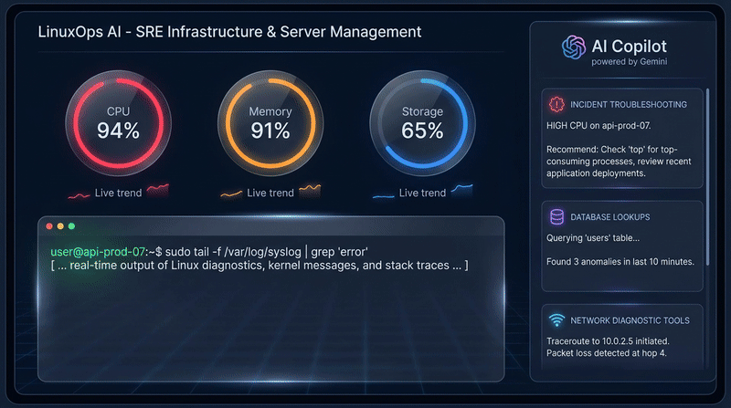

# LinuxOps AI Agent

> **Enterprise SRE & Infrastructure Advisory Platform Powered by Google ADK & Vertex AI**



LinuxOps AI is an interactive Site Reliability Engineering (SRE) and Linux server operations platform built with the **Google Agent Development Kit (ADK)** and **Vertex AI Agent Engine**.

---

## 🌟 Implemented Capabilities & Google Cloud Services

The agent implementation in `app/agent.py` and `app/app_utils/` configures and connects the following tools and services:

### 🧠 1. Vertex AI Memory Bank
- **Implementation**: Uses `PreloadMemoryTool()` and `generate_memories_callback` (`add_session_to_memory()`).
- **Capability**: Preserves user preferences, previous incident details, and server history across multiple chat sessions.

### 🗄️ 2. Cloud Firestore Database Integration
- **Implementation**: `search_food_allergens_database` and `add_or_update_food_allergen` in `app/app_utils/firestore_tools.py`.
- **Capability**: Queries and updates structured records in the GCP Cloud Firestore database (`food_allergens` collection).

### 🪣 3. GCP Cloud Storage & Artifact Management
- **Implementation**: `generate_domain_item_video` in `app/app_utils/video_tools.py`.
- **Capability**: Streams generated media to Google Cloud Storage public buckets and registers artifacts in the ADK Playground via `tool_context.save_artifact`.

### 📚 4. Vertex AI RAG Engine Grounding
- **Implementation**: `query_herbal_rag_corpus` in `app/app_utils/rag_tools.py`.
- **Capability**: Queries a serverless Vertex AI RAG corpus grounded on Nicholas Culpeper's *The Complete Herbal*.

### 🐍 5. Agent Engine Sandbox Code Executor
- **Implementation**: `AgentEngineSandboxCodeExecutor` in `app/agent.py`.
- **Capability**: Safely executes Python code inside an isolated Vertex AI Agent Engine cloud sandbox for calculations and data processing.

### 🎨 6. A2UI Declarative UI Component Manager
- **Implementation**: `A2uiSchemaManager` (version 0.8) and `BasicCatalog` in `app/app_utils/a2ui_utils.py`.
- **Capability**: Formats LLM responses into structured `<a2ui-json>` declarative UI cards processed via `a2ui_after_model_callback`.

### 🌐 7. Public Network Diagnostics API Tool
- **Implementation**: `lookup_ip_network_info` in `app/app_utils/network_tools.py`.
- **Capability**: Fetches real-time public IP and domain geolocation and AS network metadata.

### 🎥 8. Google Omni Video Generator
- **Implementation**: Uses Google's Omni model (`gemini-omni-flash-preview`) in the `global` region via `client.interactions.create`.
- **Capability**: Generates domain visualization videos and returns public storage URLs.

---

## 🛠️ Project Structure

```text
LinuxOps/
├── README.md                 # Project documentation & capabilities
├── project_brief.md          # Project brief & domain overview
├── agent_demo.gif            # Inline looping demo recording
├── agent/                    # Python ADK Agent service
│   ├── agents-cli-manifest.yaml # Agent deployment manifest
│   ├── pyproject.toml        # Dependencies & virtual environment config
│   └── app/
│       ├── agent.py          # Root ADK Agent configuration & tool wiring
│       └── app_utils/
│           ├── a2ui_utils.py       # A2UI schema manager & after_model_callback
│           ├── firestore_tools.py  # Firestore database tools
│           ├── memory_config.py    # Memory Bank helpers
│           ├── network_tools.py    # Network diagnostic tools
│           ├── rag_tools.py        # Vertex AI RAG corpus search
│           └── video_tools.py      # Google Omni video generator
└── src/                      # Vite + React 18 Frontend
    ├── App.tsx               # App layout & routing
    └── pages/                # Workspace, Dashboard, & Copilot pages
```

---

## 🚀 Local Setup & Development Instructions

### 1. Prerequisites
- Node.js `v18.0.0` or higher
- Python `3.13` or `3.14` with `uv` package manager
- Google Cloud SDK (`gcloud`) with active GCP authentication

### 2. Install Frontend Dependencies

```bash
npm install
```

### 3. Install Agent Dependencies

```bash
cd agent
uv sync
```

### 4. Start Local Development Server

Run the Vite development server locally:

```bash
npm run dev
```

To run the ADK Agent locally:

```bash
uv run python -m app.agent
```

---

*LinuxOps AI • Enterprise SRE Advisory Platform • Powered by Google ADK & Vertex AI*
